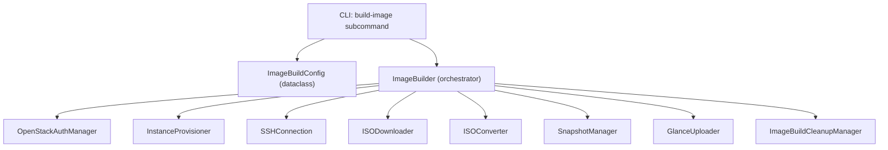

# Design Document: Proxmox qcow2 OpenStack SDK

## Overview

This feature extends the existing `proxmox_install_automation` package with a new image-building pipeline that produces Proxmox VE qcow2 disk images on OVH OpenStack. The pipeline orchestrates a multi-step workflow: authenticate → create a temporary SLES build instance → download the Proxmox ISO → convert to qcow2 via `qemu-img` → create a snapshot → upload the final image to Glance → cleanup. A CLI subcommand (`build-image`) exposes the pipeline, and a new SkillHub chapter documents the approach.

The design reuses the project's established patterns — dataclass models, OpenStack SDK connection management, SSH-based remote execution, YAML configuration, and Click CLI — while introducing new modules specific to the image-building concern.

## Architecture



### Layer Responsibilities

| Layer | Responsibility |
|-------|---------------|
| CLI | Parse `build-image` subcommand args, load YAML config, invoke orchestrator, format output |
| Configuration | Validate and model the image build parameters (`ImageBuildConfig` dataclass) |
| Orchestrator (`ImageBuilder`) | Sequence the pipeline steps, manage state transitions, delegate to components |
| Components | Each component owns one concern: instance creation, ISO download, conversion, snapshot, upload |
| Cleanup | Reverse-order resource destruction with retry logic |

### Integration with Existing Code

The new modules live under `proxmox_install_automation/image_builder/` and reuse:
- `auth.manager.OpenStackAuthManager` — authentication (extended to verify Compute, Image, Network services)
- `provisioner.instance.InstanceProvisioner` — instance lifecycle (reused directly)
- `provisioner.ssh.SSHConnection` — remote command execution
- `models.Credentials`, `models.Instance` — existing dataclasses
- `exceptions` — extended with new error types
- `config_loader` pattern — new `load_image_build_config()` function

## Components and Interfaces

### 1. `ImageBuildConfig` (Configuration Model)

```python
@dataclass
class ImageBuildConfig:
    """Configuration for the qcow2 image build pipeline."""
    # Required
    iso_url: str                    # HTTPS URL to Proxmox ISO
    base_image_name: str            # SLES image name in OpenStack
    flavor_name: str                # Compute flavor for build instance
    target_image_name: str          # Name for the final Glance image
    
    # Authentication (reuses existing Credentials)
    credentials: Credentials
    
    # Instance config
    ssh_key_name: str
    ssh_key_path: str
    network_name: str = "Ext-Net"
    
    # Optional
    proxmox_version: str = "8.2"
    target_visibility: str = "private"       # private | shared | public
    build_timeout: int = 1800                # 60–7200 seconds
    iso_expected_size: Optional[int] = None  # bytes, for integrity check
    iso_download_dir: str = "/tmp"           # directory on build instance
    iso_download_timeout: int = 1800         # seconds
    conversion_timeout: int = 600            # seconds
    snapshot_timeout: int = 1800             # seconds
```

### 2. `ImageBuildConfigValidator`

Validates the config before pipeline execution:
- All required fields present and non-empty
- `iso_url` uses HTTPS protocol
- `target_visibility` ∈ {`private`, `shared`, `public`}
- `build_timeout` ∈ [60, 7200]
- Returns all validation errors in a single `ConfigurationError`

### 3. `ImageBuilder` (Orchestrator)

```python
class ImageBuilder:
    """Orchestrates the complete qcow2 image build pipeline."""
    
    def build(self, config: ImageBuildConfig) -> ImageBuildResult:
        """Execute the full pipeline, returning image ID on success."""
        ...
    
    def validate_config(self, config: ImageBuildConfig) -> bool:
        """Validate config without executing."""
        ...
```

Pipeline steps (in order):
1. Validate configuration
2. Authenticate and verify service endpoints (Compute, Image, Network)
3. Create Base Instance (`proxmox-installer-{unix_timestamp}`)
4. Wait for ACTIVE status (poll every 10s, timeout configurable)
5. Establish SSH connection
6. Check disk space on instance
7. Download ISO via SSH
8. Verify ISO integrity (file size check)
9. Convert ISO to qcow2 via `qemu-img convert`
10. Verify qcow2 output file
11. Create server snapshot
12. Wait for snapshot ACTIVE
13. Upload qcow2 to Glance with metadata
14. Wait for image ACTIVE
15. Cleanup (reverse order: snapshot → instance → floating IP)

### 4. `ISODownloader`

```python
class ISODownloader:
    """Downloads and verifies the Proxmox ISO on the build instance."""
    
    def check_disk_space(self, ssh: SSHConnection, directory: str, required_bytes: int) -> bool:
        ...
    
    def download(self, ssh: SSHConnection, url: str, dest_dir: str, timeout: int) -> str:
        """Returns path to downloaded ISO. Retries up to 3 times."""
        ...
    
    def verify_integrity(self, ssh: SSHConnection, file_path: str, expected_size: int) -> bool:
        ...
```

### 5. `ISOConverter`

```python
class ISOConverter:
    """Converts ISO to qcow2 format via qemu-img."""
    
    def convert(self, ssh: SSHConnection, iso_path: str, qcow2_path: str, timeout: int = 600) -> str:
        """Returns path to qcow2 file. Raises on failure or timeout."""
        ...
    
    def verify_output(self, ssh: SSHConnection, qcow2_path: str) -> bool:
        """Verifies qcow2 file exists and has size > 0."""
        ...
```

Command used: `qemu-img convert -f raw -O qcow2 <iso_path> <qcow2_path>`

### 6. `SnapshotManager`

```python
class SnapshotManager:
    """Manages OpenStack server snapshots."""
    
    def create_snapshot(self, connection: Connection, server_id: str, name: str) -> str:
        """Creates snapshot, returns snapshot image ID."""
        ...
    
    def wait_for_active(self, connection: Connection, image_id: str, timeout: int) -> bool:
        """Polls every 10s until ACTIVE or timeout."""
        ...
    
    def delete_snapshot(self, connection: Connection, image_id: str) -> bool:
        ...
```

Snapshot naming: `proxmox-<version>-<YYYYMMDD-HHMMSS>` (UTC timestamp from build start)

### 7. `GlanceUploader`

```python
class GlanceUploader:
    """Uploads qcow2 images to OpenStack Glance."""
    
    def upload(self, connection: Connection, image_data: bytes, metadata: ImageMetadata) -> str:
        """Uploads image, returns Glance image ID. Retries up to 3 times."""
        ...
    
    def wait_for_active(self, connection: Connection, image_id: str, timeout: int) -> bool:
        """Polls every 10s until ACTIVE."""
        ...
```

Image metadata:
- `disk_format`: "qcow2"
- `container_format`: "bare"
- `name`: from config `target_image_name`
- `proxmox_version`: from config
- `build_timestamp`: ISO 8601 format (UTC)
- `visibility`: from config (default "private")

### 8. `ImageBuildCleanupManager`

```python
class ImageBuildCleanupManager:
    """Cleans up build resources in reverse creation order."""
    
    def cleanup(self, resources: List[CleanupResource]) -> CleanupReport:
        """Destroys resources in reverse order. Retries each up to 3 times."""
        ...
```

Cleanup order (reverse of creation):
1. Intermediate snapshot
2. Base Instance
3. Floating IP

Each destruction retried up to 3 times. Failures logged as warnings; cleanup continues.

### 9. CLI Extension

The existing Click-based CLI gains a new `build-image` subcommand (added as a Click group):

```python
@click.command("build-image")
@click.option("--config", "-c", required=True, type=click.Path(exists=True))
@click.option("--dry-run", is_flag=True, default=False)
def build_image(config: str, dry_run: bool) -> None:
    ...
```

- stdout: build progress, final image ID + name on success
- stderr: error messages on failure
- Exit codes: 0 (success), 1 (build/config failure)

## Data Models

### New Dataclasses

```python
@dataclass
class ImageBuildConfig:
    """Complete image build configuration (see Components section)."""
    iso_url: str
    base_image_name: str
    flavor_name: str
    target_image_name: str
    credentials: Credentials
    ssh_key_name: str
    ssh_key_path: str
    network_name: str = "Ext-Net"
    proxmox_version: str = "8.2"
    target_visibility: str = "private"
    build_timeout: int = 1800
    iso_expected_size: Optional[int] = None
    iso_download_dir: str = "/tmp"
    iso_download_timeout: int = 1800
    conversion_timeout: int = 600
    snapshot_timeout: int = 1800


@dataclass
class ImageBuildResult:
    """Result of a successful image build."""
    image_id: str
    image_name: str
    build_duration_seconds: float
    snapshot_id: Optional[str] = None


@dataclass
class ImageMetadata:
    """Metadata attached to the Glance image."""
    name: str
    disk_format: str = "qcow2"
    container_format: str = "bare"
    proxmox_version: str = ""
    build_timestamp: str = ""   # ISO 8601
    visibility: str = "private"


@dataclass
class CleanupResource:
    """A resource to be cleaned up."""
    resource_type: str          # "snapshot" | "instance" | "floating_ip"
    resource_id: str
    resource_name: Optional[str] = None


@dataclass
class CleanupReport:
    """Report of cleanup operations."""
    total: int
    succeeded: int
    failed: int
    failures: List[str] = field(default_factory=list)
```

### New Exceptions

```python
class ImageBuildError(ProxmoxAutomationError):
    """Raised when the image build pipeline fails."""
    pass

class ISODownloadError(ProxmoxAutomationError):
    """Raised when ISO download fails after retries."""
    pass

class ISOConversionError(ProxmoxAutomationError):
    """Raised when qemu-img conversion fails."""
    pass

class SnapshotError(ProxmoxAutomationError):
    """Raised when snapshot creation/wait fails."""
    pass

class GlanceUploadError(ProxmoxAutomationError):
    """Raised when Glance upload fails after retries."""
    pass
```

### YAML Configuration Schema

```yaml
image_build:
  iso_url: "https://download.proxmox.com/iso/proxmox-ve_8.2-1.iso"
  base_image_name: "SLES 15 SP5"
  flavor_name: "b2-30"
  target_image_name: "proxmox-ve-8.2-qcow2"
  proxmox_version: "8.2"
  target_visibility: "private"        # private | shared | public
  build_timeout: 1800                 # seconds (60–7200)
  iso_expected_size: 1200000000       # bytes (optional)
  iso_download_dir: "/tmp"
  iso_download_timeout: 1800
  conversion_timeout: 600
  snapshot_timeout: 1800

openstack:
  auth_url: "https://auth.cloud.ovh.net/v3"
  region: "GRA9"
  auth_type: "v3applicationcredential"
  application_credential_id: "${OS_APPLICATION_CREDENTIAL_ID}"
  application_credential_secret: "${OS_APPLICATION_CREDENTIAL_SECRET}"

instance:
  ssh_key_name: "my-key"
  ssh_key_path: "~/.ssh/id_rsa"
  network_name: "Ext-Net"
```

## Correctness Properties

*A property is a characteristic or behavior that should hold true across all valid executions of a system — essentially, a formal statement about what the system should do. Properties serve as the bridge between human-readable specifications and machine-verifiable correctness guarantees.*

### Property 1: Missing required fields validation

*For any* subset of required configuration fields (ISO URL, base image name, flavor name, target image name) that are missing or empty, the validator SHALL raise a single error listing exactly those missing field names — no more, no fewer.

**Validates: Requirements 1.4, 9.3**

### Property 2: Configuration rejects invalid values

*For any* ISO URL that does not begin with `https://`, *for any* visibility value not in `{"private", "shared", "public"}`, and *for any* build timeout outside the range [60, 7200], the validator SHALL reject the configuration with a descriptive error.

**Validates: Requirements 9.4, 9.5, 9.6**

### Property 3: Instance naming format

*For any* unix timestamp (positive integer), the generated Base_Instance name SHALL match the pattern `proxmox-installer-{timestamp}` where `{timestamp}` is the exact integer value.

**Validates: Requirements 2.5**

### Property 4: Snapshot naming format

*For any* Proxmox version string and *for any* UTC datetime, the generated snapshot name SHALL match the pattern `proxmox-{version}-{YYYYMMDD-HHMMSS}` with correct zero-padding.

**Validates: Requirements 5.2**

### Property 5: qemu-img command construction

*For any* valid file path pair (iso_path, qcow2_path), the constructed conversion command SHALL be exactly `qemu-img convert -f raw -O qcow2 {iso_path} {qcow2_path}`.

**Validates: Requirements 4.2**

### Property 6: ISO integrity check is strict equality

*For any* pair of (actual_file_size, expected_file_size), the integrity check SHALL pass if and only if actual_file_size equals expected_file_size.

**Validates: Requirements 3.2**

### Property 7: Glance image metadata completeness

*For any* valid ImageBuildConfig, the metadata produced for Glance upload SHALL contain all required fields: name (matching target_image_name), disk_format ("qcow2"), container_format ("bare"), proxmox_version, build_timestamp (valid ISO 8601), and visibility.

**Validates: Requirements 6.2, 6.3**

### Property 8: Authentication error includes full context

*For any* auth_url string, failing service name, and failure reason, the raised authentication error message SHALL contain all three values.

**Validates: Requirements 1.2**

### Property 9: Disk space error includes both values

*For any* pair (available_bytes, required_bytes) where available_bytes < required_bytes, the raised error SHALL contain both the available and required byte values.

**Validates: Requirements 3.5**

### Property 10: Conversion error propagates stderr

*For any* non-empty stderr string produced by a failed qemu-img execution, the raised ISOConversionError SHALL contain that stderr string.

**Validates: Requirements 4.3**

### Property 11: Cleanup ordering invariant

*For any* set of created resources (snapshot, instance, floating IP), the cleanup manager SHALL always process them in reverse creation order: snapshots first, then instances, then floating IPs.

**Validates: Requirements 7.6**

## Error Handling

### Error Hierarchy

All new exceptions extend `ProxmoxAutomationError` following existing patterns:

| Exception | Trigger | Contains |
|-----------|---------|----------|
| `ConfigurationError` | Missing/invalid config fields | List of all invalid fields |
| `AuthenticationError` | Auth failure or service unreachable | auth_url, service name, reason |
| `InstanceCreationError` | Instance fails to create or reach ACTIVE | Instance name, timeout/status |
| `ISODownloadError` | Download fails after 3 retries | URL, failure reason, attempt count |
| `ISOConversionError` | qemu-img exits non-zero or timeout | stderr output or elapsed time |
| `SnapshotError` | Snapshot fails or times out | Snapshot name, status, elapsed time |
| `GlanceUploadError` | Upload fails after 3 retries | HTTP status, response body |
| `ImageBuildError` | General pipeline failure | Step name, root cause |

### Retry Strategy

| Operation | Max Retries | Delay Between | On Final Failure |
|-----------|-------------|---------------|-----------------|
| ISO Download | 3 | 10 seconds | Raise `ISODownloadError` |
| Glance Upload | 3 | exponential (not specified, use 10s) | Raise `GlanceUploadError` |
| Resource Cleanup | 3 per resource | immediate | Log warning, continue |

### Cleanup-on-Failure Guarantee

The `ImageBuilder` uses a try/finally pattern (matching the existing `ProxmoxBuilder`):
- On any exception during the pipeline, the finally block invokes `ImageBuildCleanupManager.cleanup()`
- Cleanup processes all registered resources regardless of which step failed
- Cleanup failures are logged but never raise — the original error is preserved

### Timeout Strategy

| Operation | Default | Configurable | Kill on Timeout |
|-----------|---------|--------------|-----------------|
| Authentication | 30s | No | N/A |
| Instance ACTIVE | 600s | Yes (`build_timeout`) | Delete instance |
| SSH Connection | 300s | No | N/A |
| ISO Download | 1800s | Yes (`iso_download_timeout`) | Kill wget process |
| qemu-img Convert | 600s | Yes (`conversion_timeout`) | Kill qemu-img process |
| Snapshot ACTIVE | 1800s | Yes (`snapshot_timeout`) | Delete snapshot + instance |
| Glance Upload | build_timeout | Yes | N/A |
| Cleanup Total | 120s | No | Log warning |

## Testing Strategy

### Dual Testing Approach

This feature uses both unit tests (example-based) and property-based tests (hypothesis) for comprehensive coverage.

### Property-Based Tests (Hypothesis)

Library: **hypothesis** (already in `requirements.txt`)

Configuration: minimum 100 iterations per property (`@settings(max_examples=100)`)

Each property test references its design document property:

```python
# Feature: proxmox-qcow2-openstack-sdk, Property 1: Missing required fields validation
@given(fields_to_omit=st.sets(st.sampled_from(REQUIRED_FIELDS), min_size=1))
def test_missing_fields_lists_all_missing(fields_to_omit):
    ...
```

Properties to implement:
1. **Property 1**: Generate random subsets of required fields to omit → verify error lists exactly those
2. **Property 2**: Generate invalid URLs (non-https), random invalid visibility strings, random out-of-range timeouts → verify rejection
3. **Property 3**: Generate random positive integers → verify name format
4. **Property 4**: Generate random version strings + datetimes → verify snapshot name format
5. **Property 5**: Generate random path strings → verify command construction
6. **Property 6**: Generate random (actual, expected) size pairs → verify pass iff equal
7. **Property 7**: Generate random valid configs → verify metadata has all fields
8. **Property 8**: Generate random (auth_url, service, reason) → verify error contains all
9. **Property 9**: Generate random (available, required) where available < required → verify error contains both
10. **Property 10**: Generate random stderr strings → verify error contains them
11. **Property 11**: Generate random resource sets → verify cleanup order

### Unit Tests (Example-Based)

Focus areas:
- CLI argument parsing and output format (Requirements 8.x)
- Auth method support (Requirement 1.3)
- Retry logic (Requirements 3.3, 6.6)
- Polling behavior with mocked OpenStack SDK (Requirements 2.2, 5.3, 6.4)
- Default configuration values (Requirement 9.2)
- SkillHub HTML structure and lessons.js entry (Requirement 10.x)

### Integration Tests

Executed against a mocked OpenStack SDK (using `pytest-mock`):
- Full pipeline happy path (mock all API calls)
- Pipeline failure at each step → verify cleanup triggered
- Authentication with both credential types

### Test Organization

```
tests/
├── test_image_builder/
│   ├── test_config_validation.py        # Properties 1, 2
│   ├── test_naming.py                   # Properties 3, 4
│   ├── test_iso_converter.py            # Properties 5, 6, 10
│   ├── test_glance_uploader.py          # Property 7
│   ├── test_error_formatting.py         # Properties 8, 9
│   ├── test_cleanup.py                  # Property 11
│   ├── test_pipeline_integration.py     # Integration tests
│   └── test_cli_build_image.py          # CLI tests
├── test_skillhub/
│   ├── test_lesson_page.py             # SkillHub HTML/accessibility
│   └── test_lessons_registry.py        # lessons.js entry
```

